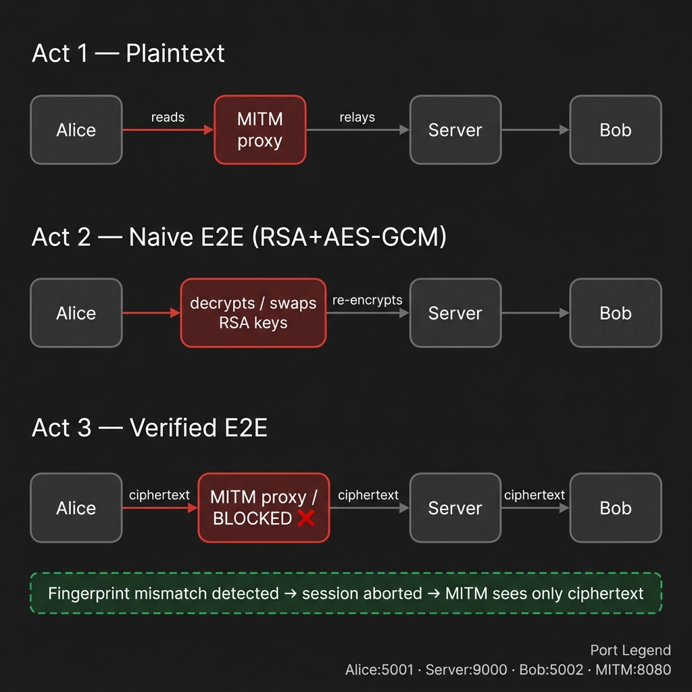

# E2E Encryption Attack Lab


**Sanskar Phougat · B.Tech ECE · JIIT Noida · CyberPeace Foundation Assignment**

A three-act live demonstration that shows **why encryption alone is not enough** — and how fingerprint verification defeats a Man-in-the-Middle attack.

---

## Architecture



| Act | Mode | What MITM sees |
|-----|------|----------------|
| **Act 1** | Plaintext chat (no encryption) | Every message in clear text |
| **Act 2** | RSA + AES-GCM encrypted (no key verification) | Full plaintext via RSA key swap |
| **Act 3** | RSA + AES-GCM + fingerprint verification | Nothing — session aborts |

---

## Prerequisites

| Tool | Version | Install |
|------|---------|---------|
| Python | 3.10 + | [python.org](https://python.org) |
| Burp Suite Community | any | [portswigger.net](https://portswigger.net/burp) |
| Wireshark | any | [wireshark.org](https://wireshark.org) |

---

## Installation

```bash
# 1. Clone the repo
git clone https://github.com/Sanskar-bot/E2E-Encryption-Attack-Lab.git
cd E2E-Encryption-Attack-Lab

# 2. Install Python dependencies
pip install cryptography flask flask-cors mitmproxy
```

---

## Port Map

| Component | Port | Started by |
|-----------|------|-----------|
| Relay server | **9000** | `server.py` |
| MITM proxy | **8080** | `mitm.py` |
| Attacker dashboard API | **7000** | `mitm.py` (Flask, auto-started) |

---

## File Structure

```
E2E-Encryption-Attack-Lab/
├── crypto_utils.py          # RSA-2048, AES-256-GCM, SHA-256 fingerprint
├── server.py                # Dumb TCP relay — never reads content
├── alice.py                 # Alice client (plain / encrypted / verified)
├── bob.py                   # Bob client  (plain / encrypted / verified)
├── mitm.py                  # Active MITM proxy + Flask dashboard API
├── mitm_addon.py            # mitmproxy professional-tool addon
├── dashboard/
│   └── index.html           # Live attacker dashboard (open in browser)
├── assets/                  # README images
└── README.md
```

---

## Act 1 — Plaintext Interception (Burp Suite)

### Burp Suite Setup

**Step 1 — Proxy listener**  
Go to **Settings → Tools → Proxy → Proxy listeners** and confirm the listener is on `127.0.0.1:8080`.


**Step 2 — Upstream proxy rule (forward to server)**  
Go to **Settings → Network → Upstream proxy servers → Add rule**:

| Field | Value |
|-------|-------|
| Destination host | `127.0.0.1` |
| Proxy host | *(leave blank)* |
| Proxy port | `9000` |


**Step 3 — Enable Intercept**  
In the **Proxy → Intercept** tab, click **Intercept is on**.


### Run (4 terminals)

```bash
# Terminal 1 — relay server
python server.py

# Terminal 2 — (Burp Suite is your MITM; no mitm.py needed for Act 1)

# Terminal 3
python alice.py plain

# Terminal 4
python bob.py plain
```

Open **Wireshark → Loopback adapter → filter** `tcp.port == 9000` to see raw plaintext packets.

---

## Act 2 — Encrypted Chat + Active Key Swap

The MITM silently replaces both RSA public keys with its own, decrypts the AES session key, and reads every "encrypted" message.

### Run (5 terminals)

```bash
# Terminal 1
python server.py

# Terminal 2
python mitm.py          # proxy :8080 + dashboard API :7000

# Terminal 3
python alice.py encrypted

# Terminal 4
python bob.py encrypted

# Terminal 5 — open dashboard in browser
# Just open  dashboard/index.html  as a file
```

**What to observe in Terminal 2:**

```
⚠  KEY SWAP  | bob   | Swapped bob's RSA public key with MITM's key
⚠  KEY SWAP  | alice | Swapped alice's RSA public key with MITM's key
🔑 SESSION KEY | alice | Decrypted AES session key: 3d9c6a7a…
🔑 SESSION KEY | alice | Re-encrypted AES key with Bob's real public key ✓
🔓 DECRYPTED | alice | hey
🔓 DECRYPTED | bob   | hello
```

Alice and Bob believe their session is secure — the MITM reads everything.

---

## Act 3 — Fingerprint Verification (Attack Fails)

### With MITM running (attack detected → session aborts)

```bash
# Terminal 1
python server.py

# Terminal 2
python mitm.py

# Terminal 3
python alice.py verified

# Terminal 4
python bob.py verified
```

Alice and Bob both display their received fingerprints.  
Because the MITM swapped the keys, **the fingerprints will not match**.  
Type **`no`** on both → both clients abort → MITM intercepts nothing.

```
⚠  MITM ATTACK DETECTED — fingerprints do not match.
✗  Aborting session. No messages were exchanged.
```

---

### Without MITM (genuine E2E — session succeeds)

```bash
# Terminal 1
python server.py

# Terminal 2  (no mitm.py)
python alice.py verified --direct     # connects directly to :9000

# Terminal 3
python bob.py verified --direct
```

Both sides see **identical** fingerprints.  
Type **`yes`** → session proceeds → fully encrypted chat with no eavesdropper.

---

## mitmproxy Professional Tool (Act 2 alternative)

```bash
mitmproxy -s mitm_addon.py --listen-port 8080 --mode reverse:http://127.0.0.1:9000
```

Then run `alice.py encrypted` and `bob.py encrypted`.  
mitmproxy's TUI shows every intercepted JSON frame in real-time.

---

## Key Concepts Demonstrated

| Concept | Demonstrated in |
|---------|----------------|
| Plaintext sniffing | Act 1 — Wireshark / Burp Suite |
| RSA key swap (MITM on key exchange) | Act 2 — `mitm.py` |
| AES-GCM session key interception | Act 2 — `mitm.py` |
| Fingerprint / Safety-number verification | Act 3 — `alice.py verified` |
| Signal / WhatsApp-style safety numbers | Act 3 — SHA-256 of DER-encoded public key |

---

## Evidence Checklist

| ID | Screenshot | Filename |
|----|-----------|---------|
| A1 | Burp Suite intercept — plaintext messages | `act1_burp_intercept.png` |
| A2 | Wireshark — plaintext in ASCII pane | `act1_wireshark.png` |
| B1 | MITM terminal — `🔓 DECRYPTED` entries | `act2_mitm_decrypts.png` |
| B2 | mitmproxy TUI — intercepted JSON frames | `act2_mitmproxy.png` |
| B3 | Attacker dashboard — key swaps + decrypted feed | `act2_dashboard.png` |
| C1 | Alice + Bob terminals — fingerprint mismatch | `act3_mismatch.png` |
| C2 | Alice + Bob terminals — matching fingerprints | `act3_match.png` |

---

## Ethical Notice

> ⚠️ **All tests are conducted exclusively on `127.0.0.1` (localhost) in a controlled,  
> single-machine environment. No real network traffic was intercepted or modified.  
> This project exists for educational purposes only as part of a  
> CyberPeace Foundation assignment. Do not use these techniques on any  
> network or system without explicit written authorisation.**

---

## License

MIT © 2026 Sanskar Phougat — see [LICENSE](LICENSE).
